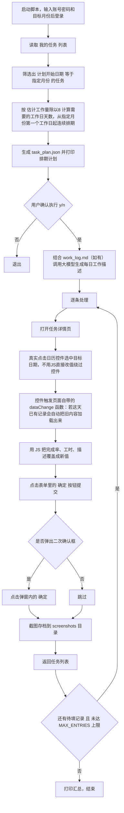

# 任务进展自动填报机器人

用 Playwright 自动登录"青铜器 RDM"项目管理系统，根据运行时输入的月份筛选任务，按 `估计工作量(小时) / 8` 算出需要的工作日天数，从指定月份第一个工作日开始连续排期，自动排除国家法定节假日和用户输入的请假日，逐日填写"执行进展"（完成率、当日投入工作量、工作描述），描述由大模型按任务名称生成、互不相同，最后提交保存。

## 功能特性

- 自动读取"我的任务"列表，筛选出计划开始日期在指定月份的任务
- 按工作量自动计算排期天数，只排到指定月份内的国家法定工作日（排除法定节假日，包含周末调休工作日）
- 支持运行时输入多天个人请假日期并从排期中排除，也可以直接回车跳过
- 完成率按**整月工作日池**统一一条进度曲线计算：当月第一个工作日 0%、最末当月工作日 100%，中间按日期位置均匀分布；今天不能填未来日期，100% 永远留给月底最后一天，今天填到最多 95%（为明天留出 100% 的位置）
- 每日工作描述调用大模型接口生成，语气自然、互不重复（接口地址/密钥自行配置，不配置则自动用模板兜底）
- 逐条真实模拟浏览器操作提交（点日历选日期、填字段、点确定、处理二次确认弹窗）
- 日历选择后和最终提交前都会强制核对执行日期；普通选择失败时自动调用页面原生 `iCalendar.setDay(...)` 重试，仍不一致则禁止误提交
- `MAX_ENTRIES` 环境变量做安全阀：默认只跑 1 条，确认没问题再调大或设 `0` 跑完全部
- 全程带时间戳的进度输出，跑到哪一步、第几条都看得见
- 每条提交后自动截图存档，方便事后核对

## 环境要求

- Python 3.10+
- 能访问目标系统 `imm.kmerit.com:64892`（一般需要在公司内网或挂 VPN）
- （可选）一个 Ollama 兼容的大模型接口，用于生成工作描述。不配置也能正常跑，会自动用模板兜底，不影响流程

## Windows 一键脚本

不想敲命令的话，项目根目录有三个 `.bat` 双击就完事：

| 脚本 | 何时用 | 干什么 |
|---|---|---|
| `安装环境.bat` | 第一次 | 检测 Python、建虚拟环境、装依赖、下载浏览器 |
| `运行填报机器人.bat` | 每次 | 启动 Web 控制台（浏览器自动打开 http://127.0.0.1:8765）|
| `打包成exe.bat` | 给同事发版本时 | 用 PyInstaller 把 webui 打成一个独立 .exe，**用户双击即可，无需装 Python** |

具体细节往下看对应章节。

### 两条使用路线怎么选

| | 路线 A：装 Python（开发者友好） | 路线 B：直接 .exe（用户友好） |
|---|---|---|
| **前置依赖** | 需要装 Python 3.10+ | **什么都不用装** |
| **首次操作** | 双击 `安装环境.bat`（约 5 分钟） | 拿到 `RDM填报机器人.exe` 直接双击 |
| **后续每次** | 双击 `运行填报机器人.bat` | 双击同一个 .exe |
| **首次额外动作** | 无 | 自动下载 Chromium（约 150MB，1-3 分钟，只下一次） |
| **可调试** | ✅ 能改源码、看 log | ❌ 看不了源码、log 只在网页里 |
| **exe 大小** | — | 约 50-80MB |
| **适合谁** | 你自己 / 同事里懂代码的 | 普通同事 / 跨部门发版本 |

判断标准很简单：

```
同事懂 Python、会改代码、要调试？
  → 路线 A（git clone + 安装环境.bat + 运行填报机器人.bat）

同事只想用、不想碰任何技术？
  → 路线 B（发他 RDM填报机器人.exe 一个文件，打包方法见"打包成 .exe"章节）
```

## 安装

```bash
python3 -m venv .venv
source .venv/bin/activate
pip install -r requirements.txt
playwright install --with-deps chromium
```

> Windows 用户直接双击 `安装环境.bat` 等价。

## 怎么运行（本机直接跑）

这个脚本**没有命令行参数**（不是 `python fill_progress.py --max-entries 5` 这种用法）。账号、密码和目标月份在运行时交互式输入，其余可调行为通过**环境变量**控制。

```bash
python fill_progress.py
```

执行后依次发生：

1. 提示输入用户名：`用户名: `，直接输入后回车
2. 提示输入密码：`密码: `（`getpass` 输入，不会回显在屏幕上，也不会存到任何文件里）
3. 提示输入月份：`要填写的月份（1-12）:`。输入的月份不晚于当前月时使用今年，否则使用去年（例如当前为 2026-08，输入 `7` 表示 2026-07，输入 `12` 表示 2025-12）
4. 提示输入请假日期。可输入当月日期数字或完整日期，用逗号、中文逗号或空格分隔，例如 `3, 8, 21` 或 `2026-08-03 2026-08-08`；直接回车表示没有请假
5. 登录成功后自动读取"我的任务"列表，按指定月份计算排期计划，打印出来，同时存一份到 `task_plan.json`
6. 提示确认：`共 N 条待填写记录，本次最多执行 M 条...确认开始？(y/n):`，输入 `y` 才会继续，输入其他任意内容会直接退出、不做任何提交
7. 确认后逐条真实提交，每条都会打印时间戳进度（打开任务、选日期、填字段、提交完成）
8. 全部跑完打印汇总："本次共提交 N 条记录"

### 目标月份规则

- 输入当前月份时，填写当月任务，执行日期最多排到今天，不会填写未来日期
- 输入早于当前月份的数字时，使用今年对应月份
- 输入晚于当前月份的数字时，使用去年对应月份
- 只接受 `1` 到 `12`；输入其他内容会要求重新输入
- 排期依据国务院法定节假日安排，法定休息日不排期，周末调休工作日正常排期
- 请假日期必须在目标月份内；重复日期会自动去重，格式错误时会提示重新输入
- 排期生成后会再次检查请假日期；只要请假日仍出现在计划中，就会立即终止

### 完成率规则（整月一条进度曲线）

完成率跟任务无关，按**当月日历工作日池**的位置统一算一条进度曲线：

- 当月**第一个**工作日 → 0%
- 当月**最末**一个工作日 → 100%
- 中间按日期在日历池中的位置线性插值（不是按任务段递增）

举例：9 月当月日历工作日池 = 22 天（9/1 ~ 9/30，含调休），今天 = 9/29。

| 任务 / 日期 | 完成率 |
|---|---:|
| 9/1（首日） | **0%** |
| 9/15 | 64% |
| 9/24 | 90% |
| 9/29（今天） | 95% |
| 9/30（明天，填不到） | **100%** ← 留给月底 |

设计意图：今天填的最多 95%，把 100% 留给月底最后一天，避免"任务最后一天还没填就先 100%"的虚高。安全阀（`MAX_ENTRIES`）再大也只会填当月工作日，不会跨月。

> 月初的小任务（如 9/1-9/2）会被分配到较低完成率（0%、5%）。这是整月统一曲线的代价，符合"今天还没到月底，不应填到 100%"的语义。

### 真实工作日志（work_log.xlsx，推荐）

大模型默认只拿到任务名，生成的工作描述靠"脑补"通用开发剧情。想让描述贴合真实工作，直接编辑项目里的 `work_log.xlsx`（Excel 两列表格），一行一段时间，行数随意增删：

| 日期段 | 工作内容 |
|---|---|
| 9.1-9.12 | 日志回访功能开发：回访记录列表、批量导入、失败重试 |
| 9.15-9.18 | 修统一检索的几个 bug，主要是排序和分页 |

不习惯 Excel 也可以用 `work_log.md`（同样的两列格式）；两个都填了时 **xlsx 优先**。用 `WORK_LOG` 环境变量可以指定任意路径。

脚本会把日志内容和每条记录对应的执行日期一起发给大模型，让它对齐到当天实际在做的事，而不是照抄原文（会改写成自然的一句话日报）；日志没覆盖的日期写"推进相关工作"这类表述，不会与日志矛盾。模板没填（空行）时行为跟以前完全一样。

**自动归档**：一次运行中所有任务的描述都生成完毕后（`MAX_ENTRIES=0` 全量跑完即是），日志自动归档——Excel 追加一个以归档时间命名的 sheet 到 `work_log_archive.xlsx`，md 则追加到 `work_log_archive.md` 文末（历史逐次累积、不会丢），原文件重置回空模板——下个月打开直接填新行即可，无需手动清理。注意：`MAX_ENTRIES` 只跑了一部分时不会重置，日志留给下次跑剩余任务时继续用。归档/重置时如果日志文件正被 Excel 等占用，会安全跳过（不影响已提交的填报，运行不会标错），日志保留、下次运行自动重试。

注意：日志内容会原文发给你配置的大模型接口，别往里面写敏感信息。

### 环境变量参数说明

| 变量 | 默认值 | 说明 |
|---|---|---|
| `MAX_ENTRIES` | `1` | 本次最多尝试几条记录（失败也计数）。`0` 表示不限制、尝试排期计划里的全部记录。**首次跑一个新任务/新账号时建议先留默认值 1，确认没问题再调大**，避免一次性处理一堆条目后才发现哪里不对 |
| `HEADLESS` | `1` | 是否无头运行。`1`（默认）不弹浏览器窗口，适合放服务器/容器里跑；`0` 会弹出可见的浏览器窗口，本机调试、定位问题时好用 |
| `OLLAMA_URL` | 空 | 生成工作描述用的大模型接口地址，支持 Ollama 原生接口（`.../api/generate`）和 OpenAI 兼容接口（DeepSeek 等，`.../chat/completions`），按 URL 自动判断。不设置就跳过大模型调用，直接用模板描述 |
| `OLLAMA_API_KEY` | 空 | 上面那个接口的 Bearer token |
| `OLLAMA_MODEL` | 自动 | 模型名。不设时按接口风格自动选：Ollama 风格用 `qwen3.6:35b-a3b`，OpenAI/DeepSeek 风格用 `deepseek-chat`；也可手动指定 |
| `WORK_LOG` | 自动探测 | 真实工作日志路径（默认优先 `work_log.xlsx`，其次 `work_log.md`，两列：日期段 / 工作内容）。有实质内容时大模型结合它生成贴合实际的描述；全部任务描述生成完后自动归档并重置为空模板，见下面"真实工作日志"一节 |

> `OLLAMA_URL`/`OLLAMA_API_KEY` 是公司内部接口，**不要**把具体地址和密钥写进代码或提交到仓库里，只通过环境变量在本机/部署环境里配置。

用法是在命令前面加环境变量，比如：

```bash
# 只跑 1 条（默认行为，等同于不写 MAX_ENTRIES）
python fill_progress.py

# 跑 5 条
MAX_ENTRIES=5 python fill_progress.py

# 把排期计划里剩下的全部跑完
MAX_ENTRIES=0 python fill_progress.py

# 本机调试，弹出可见浏览器窗口，只跑 1 条
HEADLESS=0 python fill_progress.py

# 两个环境变量一起用
HEADLESS=0 MAX_ENTRIES=3 python fill_progress.py

# 配置大模型接口，用真实生成的描述而不是模板
OLLAMA_URL="https://your-ollama-host:port/api/generate" OLLAMA_API_KEY="你的token" python fill_progress.py
```

### ⚠️ 使用前必读：不会自动跳过"已经填对"的日期

脚本没有"这天是不是已经填过、填对了"的判断逻辑——`assigned_dates` 每次都是从排期计划的第一天开始算。如果某些日期在系统里已经有**真实**的工作记录（不是占位/测试数据），直接调大 `MAX_ENTRIES` 重跑，会把这些真实记录用大模型生成的内容覆盖掉。批量跑之前，务必先去系统里确认一下要处理的那些日期到底是空的、是占位测试数据，还是已经有真实内容，避免误覆盖。

## 怎么运行（Web 控制台）

不想敲命令行、也不想每次设环境变量，可以起一个本地网页控制台：

```powershell
python webui.py
```

会自动打开 <http://127.0.0.1:8765>（没自动开就手动访问）。页面上把 RDM 账号密码、月份、请假日期、安全阀条数、无头开关、大模型接口和工作日志一次填好，点"开始"即可：

- 跑的是和命令行**完全同一套** `fill_progress.py` 逻辑（登录 → 排期 → 确认 → 逐条提交）
- 排期生成后页面上显示计划表格，点"确认开始提交"才真正动 RDM，对应命令行的 `y/n` 确认
- 运行日志实时滚动显示，和终端里看到的一模一样
- 大模型接口、工作日志都能直接在页面上填写/保存，不用碰环境变量和 Excel

说明：

- 仅监听 `127.0.0.1`，局域网里别的机器访问不到；密码只在内存中转，不落盘
- API Key 留空表示沿用启动时的环境变量或上次运行填的值（页面上只显示掩码，不回明文）
- `WEBUI_PORT` 环境变量可改端口；`WEBUI_NO_BROWSER=1` 时不自动打开浏览器
- 排期确认页挂着 10 分钟没响应会自动取消并关闭浏览器，不会一直占着

## 整体流程



## 踩过的坑：那个日历控件

这是整个自动化里最难排查、也是最关键的一个坑，记录下来避免以后重复踩。

### 现象

一开始的实现是这样的：直接用 Playwright 的 `fill()` 或者干脆用 JS 给 `#report_action_date` 这个日期输入框赋值、派发 `input`/`change` 事件，绕开页面自带的日历弹出控件。

表面上看完全没问题——日期字段显示的值是对的，表单提交也没有任何报错，脚本正常跑完。但去系统里实际核对，发现数据根本没有更新：如果这天已经有一条记录，内容还是旧的；折腾了好几轮换着法子改（`fill()` → `dispatchEvent` → 手动调用 `dataChange()`），结果一模一样——**服务端就是把这次提交当成无效/重复提交，安安静静地丢掉了，不报任何错**。

### 根因

翻页面源码才挖到关键信息：

```html
<textarea id="report_action_date" onfocus="iCalendar.setDay($(this), 'dataChange');"></textarea>
<textarea id="report_rate" onkeydown="dataChange();"></textarea>
<textarea id="report_in_work" onkeydown="dataChange();"></textarea>
```

- 日期字段绑定的是 `onfocus`，聚焦时会调 `iCalendar.setDay(...)` 弹出日历控件，并且约定好日期真正选中后要回调 `dataChange`
- 完成率、工时字段绑定的是 `onkeydown`，**只有真实按键才会触发**

而 `dataChange()` 这个函数，正是负责"根据当前选中的日期，去查这天是不是已经有记录、有的话把内容加载出来"的逻辑——本质上就是"新建"和"编辑已有记录"两种状态切换的开关。真人手动点日历选日期时会正常触发它，所以能看到旧内容、在此基础上编辑保存；而无论是 `fill()` 还是手动 `dispatchEvent(new Event('input'))`，都**不会产生真实的 keydown/日历选中事件**，这个状态切换就从来没发生过——提交的东西看起来对，但服务端根本不知道这是要编辑哪条记录。

### 解法

老老实实、完全模拟真人操作：点击输入框弹出日历 → 读 `#c_year` / `#c_month` 判断当前显示的是哪个月 → 用"上一月/下一月"箭头翻到目标月份 → 精确点击目标日期那个格子。日历格子的 `title` 属性正好是完整日期（格式 `"YYYY-M-D"`，月日不补零，比如 `title="2026-7-1"`），可以直接拿来定位：

```python
title_attr = f"{target.year}-{target.month}-{target.day}"
cell = entity_frame.locator(f'#c_body td[title="{title_attr}"]')
cell.first.click()
```

这样日历控件自己的 `dataChange()` 逻辑会被正常触发，提交时才真的是在"编辑这条已有记录"，服务端才认。

**教训**：遇到"界面上看着改对了、提交也不报错，但数据死活不生效"这种情况，第一反应不该是继续换姿势用 JS 硬改值，而是要去翻页面源码，看这个控件到底绑定的是什么事件（`onfocus`/`onkeydown`/`onchange`……），绕过控件的同时很可能也绕过了它背后真正要做的业务逻辑。另外弹窗按钮定位也踩过类似的坑：确认弹窗里的"确定"实际是 `<input value="确定">`，`get_by_text()` 根本匹配不到 `value` 属性，得改用 `input[value="确定"]` 这种选择器。

## Docker 运行

### 构建镜像

```bash
docker build -t task-flow-agent .
```

如果 build 环境访问 Docker Hub / PyPI / apt 源需要走代理，加上代理参数（只在 build 阶段生效，不会带进最终镜像）：

```bash
docker build --network host \
  --build-arg HTTP_PROXY=http://127.0.0.1:10808 \
  --build-arg HTTPS_PROXY=http://127.0.0.1:10808 \
  --build-arg http_proxy=http://127.0.0.1:10808 \
  --build-arg https_proxy=http://127.0.0.1:10808 \
  -t task-flow-agent .
```

`playwright install --with-deps chromium` 这一步会下载 Chromium 浏览器本体、装一大堆系统依赖，加上单独的 `apt-get update` 装中文字体包，正常情况下要跑几分钟，属于预期耗时，不是卡住了。

### 运行容器

**Linux / WSL(bash)：**

```bash
docker run -it --rm -e MAX_ENTRIES=1 task-flow-agent
```

**Windows PowerShell：**

```powershell
docker run -it --rm -e MAX_ENTRIES=1 task-flow-agent
```

两边命令是一样的，不需要挂载任何目录——镜像里已经内置了代码，跟宿主机没有依赖关系。

参数说明：

- `-it`：**必须加**。账号密码是容器启动后 `getpass` 交互式输入的，不落盘，没有 `-it` 拿不到你的输入，脚本会卡住或直接报错
- `--rm`：容器退出后自动删除容器本身（不影响镜像），避免每次跑完留一堆已停止的容器
- `-e MAX_ENTRIES=1`：跟本机直接跑一样的环境变量，见上面"环境变量参数说明"那张表。容器里 `HEADLESS` 默认就是 `1`，一般不需要再传

如果想让运行产生的截图（`screenshots/` 目录）跑完之后能留在宿主机上查看（不然 `--rm` 会把容器和里面写的文件一起删掉），把这一个目录挂出来就行，不用挂整个项目：

```bash
# Linux / WSL(bash)
docker run -it --rm -v "$(pwd)/screenshots:/app/screenshots" -e MAX_ENTRIES=1 task-flow-agent
```

```powershell
# Windows PowerShell（注意路径写法跟 bash 不一样）
docker run -it --rm -v "${PWD}\screenshots:/app/screenshots" -e MAX_ENTRIES=1 task-flow-agent
```

> PowerShell 里踩过一个坑：`-v "$(pwd)":/app` 这种写法在 bash 下没问题，但 PowerShell 的 `$(pwd)` 返回的是带盘符的 Windows 路径（比如 `C:\Users\...`），跟 `-v` 参数本身的 `host:container` 冒号分隔格式冲突，会报 `invalid reference format`。所以 PowerShell 下要用 `${PWD}` 并按上面的写法拼。

### 其他注意事项

- 容器和宿主机是两个隔离的环境，即使都在你自己电脑上，容器里默认也没有图形界面/显示器——`HEADLESS=1` 是唯一在容器里能正常工作的模式，不要指望它像本机直接跑脚本那样弹出浏览器窗口
- Windows 上如果用 Docker Desktop，确认它跑的是 "Linux containers" 模式（默认模式），不能是 "Windows containers" 模式，否则这个基于 `python:3.11-slim` 的镜像根本起不来

## 打包成 .exe（双击就能用，无需 Python）

如果想给不懂代码的同事用，可以把整个 webui + 依赖打成一个独立 `.exe`，用户双击就启动，不用装 Python。

### 一键打包

```powershell
双击 打包成exe.bat
```

等 2-3 分钟，会在 `dist/` 生成 `RDM填报机器人.exe`（约 50-80 MB）。把 `dist/RDM填报机器人.exe`（可以连同 README）发给用户。

### 用户首次启动

1. 双击 `RDM填报机器人.exe`
2. **首次会弹"首次运行：正在下载 Chromium 浏览器（约 150MB）"** —— 自动下载到 `%LOCALAPPDATA%\ms-playwright\`，约 1-3 分钟（只下一次，后续秒过）
3. 浏览器自动开 `http://127.0.0.1:8765`
4. 填表单、跑

> 网络问题或杀软拦截：若 Chromium 下载失败，控制台会输出原因；部分杀软会误报 PyInstaller 打的 exe，需要把 exe 加白名单。

### exe 的工作目录自动改到 exe 旁边

代码里检测 `sys.frozen` 后会 `os.chdir(os.path.dirname(sys.executable))`，所以 `work_log.xlsx`、`task_plan.json` 等文件都放在 exe 同级目录就行，不要放在 exe 内部。

### 已知局限

- 首次下载 Chromium 需 ~150MB 网络流量（之后离线运行）
- 改了源码想发新版 → 重跑 `打包成exe.bat`
- PyInstaller 打出的 exe 体积较大（约 50-80MB），启动比直接 `python webui.py` 慢几秒

## 文件说明

| 文件 | 说明 |
|---|---|
| `fill_progress.py` | 主脚本：登录、读取任务、排期、逐条自动填报 |
| `llm_helper.py` | 调用大模型接口（地址/密钥走环境变量配置），为任务生成每日工作描述 |
| `webui.py` | 本地 Web 控制台：浏览器里填表单运行主脚本（`python webui.py`，仅监听 127.0.0.1） |
| `work_log.xlsx` | 真实工作日志（Excel 两列：日期段 / 工作内容），填了内容则大模型结合它生成贴合实际的描述；全部任务描述生成完后自动归档并重置回空模板 |
| `work_log.md` | 同上的 Markdown 备选格式（xlsx 优先）；不填则不生效 |
| `work_log_archive.xlsx` / `work_log_archive.md` | 每次自动归档的工作日志历史（追加累积），运行时产物，不进版本库 |
| `requirements.txt` | Python 依赖 |
| `Dockerfile` | 镜像构建文件 |
| `安装环境.bat` | Windows 一键装环境（venv + 依赖 + Chromium） |
| `运行填报机器人.bat` | Windows 一键启动 Web 控制台（依赖 .venv） |
| `打包成exe.bat` | Windows 一键 PyInstaller 打包，输出 `dist/RDM填报机器人.exe` |
| `task_plan.json` | 每次运行自动生成的排期计划（含生成的描述），运行时产物，不进版本库 |
| `raw_tasks.json` | 每次运行自动生成的任务列表原始数据，运行时产物，不进版本库 |
| `screenshots/` | 每条提交后的截图存档，运行时产物，不进版本库 |
